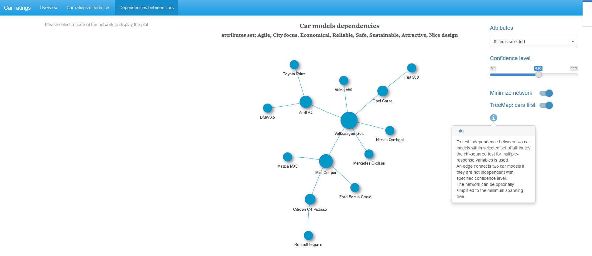
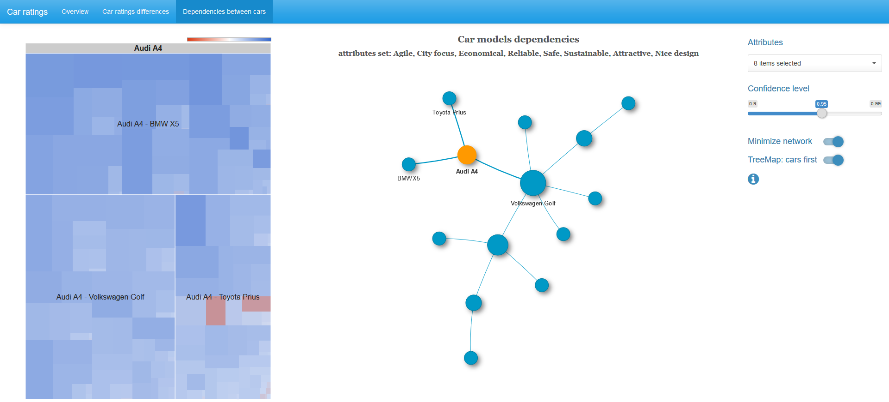

Brands Analysis
================

This shiny app allows you to analyse marketing data with multiple-response variables.

### What are the multiple response variables?

Surveys often contain questions in which respondents are able to choose from the list of answer options as many answers as they like. The example of such question below is taken from the Customer Satisfaction Survey Template provided by Survey Monkey ([link](https://www.surveymonkey.com/mp/customer-satisfaction-survey-template/)).

### Data used in the application

We focus on the typical case where respondents are asked to match a set of attributes for a group of brands. Data in the example is part of the dataset with cars attributes ratings (Van Gysel 2011) that is included to R-package `plfm` (Meulders and De Bruecker 2017). The dataset contains the ratings of 78 respondents about the association between each of 14 car models and each of 15 car attributes.

In the screenshot below (each screenshot is clickable to open it in a full size) you may see that 40 respondents supposed that the Fiat 500 is attractive.

Each of these 14 variables with car models is a multiple-response variable from 15 options.

### Comparison of the car ratings

We can compare attribute ratings between any car and the average sample ratings. The central polar chart below shows the strengths and weaknesses of the selected car model.

Also, you can compare attribute ratings between any two car models.

To compare rating values for each attribute between two car models we use the McNemar mid-p test. Details about the test can be found in this article (Fagerland, Lydersen, and Laake 2013). If we compare rating values between a car model and the sample average ratings the binomial mid-p test is applied. Only significant different values are displayed on the polar chart.

Here we change the confidence level to 0.99 and remove the grouping border of the polar chart.

### Dependencies between the cars

This is a way to understand the associations between the cars (in terms of customers) in the selected set of attributes.

An edge connects two nodes with cars if they are not independent within the specified set of attributes. To reject independence between two car models with the specified confidence level we use the chi-square test with the 2nd order Rao-Scott adjustment. This approach was proposed in the article (Bilder and Loughin 2004).

Package `MRCV` (Koziol and Bilder 2014) provides such kind of routines, but the application uses an improved implementation of this test. Details can be found in this [repository](https://github.com/e-chankov/MItest_improvements) (Chankov 2017).

In additions, if a node of the network is selected, you may see the tree map chart with non-adjusted chi-square values.

When a pair of brands is choosen you may compare the size of cells (the larger the cell, the greater its contribution to the total chi-square). Color of the cells is based on log odds ratio: blue for positive values, zero is white, red for negative values (note, the color scale is non-symmetric, that is ends of its range are not equal by absolute value).

Sure, you may specify your own set of attributes

switch off the minimum spanning tree algorithm and change the confidence level

### Input data specification

Application reads data from a text file in csv format. It should consists of named columns with {0,1} values. Each column name has the following structure "&lt;brand name&gt; | &lt;attribute name&gt;". Every &lt;brand&gt; must have the same set of attributes.

There are two additional text files to control the brands and attributes sets. One of them contains the list of brands that are the same as in the csv dataset. The second file contains the list of attributes from the csv grouped in the named columns.

### Required libraries to run the app

    #### shiny libraries
    library(shiny)          # version 1.0.5
    library(shinythemes)    # version 1.1.1
    library(shinydashboard) # version 0.6.1
    library(shinyBS)        # version 0.61
    library(shinyWidgets)   # version 0.3.6

    #### libraries to visualization
    library(wordcloud2)     # version 0.2.0
    library(highcharter)    # version 0.5.0
    library(googleVis)      # version 0.6.2
    library(visNetwork)     # version 2.0.1
    library(RColorBrewer)   # version 1.1-2

    #### data munging libraries
    library(data.table)     # version 1.10.4
    library(checkmate)      # version 1.8.4
    library(Matrix)         # version 1.2-11 
    library(igraph)         # version 1.1.2
    library(stringi)        # version 1.1.5

### References

Bilder, C., and T. Loughin. 2004. “Testing for Marginal Independence Between Two Categorical Variables with Multiple Responses.” *Biometrics* 60 (1): 241–48. <http://dx.doi.org/10.1111/j.0006-341X.2004.00147.x>.

Chankov, E. 2017. *Improved Implementation of the Marginal Independence Test* (version 0.1). <https://github.com/e-chankov/MItest_improvements>.

Fagerland, Morten W., Stian Lydersen, and Petter Laake. 2013. “The Mcnemar Test for Binary Matched-Pairs Data: Mid-P and Asymptotic Are Better Than Exact Conditional.” *BMC Medical Research Methodology* 13 (1): 91. <https://doi.org/10.1186/1471-2288-13-91>.

Koziol, N., and C. Bilder. 2014. *MRCV: Methods for Analyzing Multiple Response Categorical Variables* (version 0.3-3). <https://cran.r-project.org/package=MRCV>.

Meulders, M., and Ph. De Bruecker. 2017. *Plfm: Probabilistic Latent Feature Analysis* (version 2.2.1). <https://CRAN.R-project.org/package=plfm>.

Van Gysel, E. 2011. “Perceptuele Analyse van Automodellen Met Probabilistische Feature Modellen.” Master’s thesis, Hogeschool-Universiteit Brussel.
